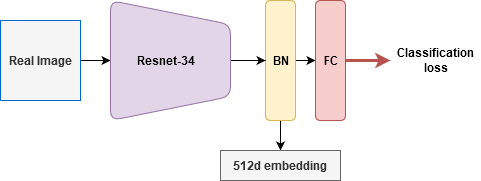
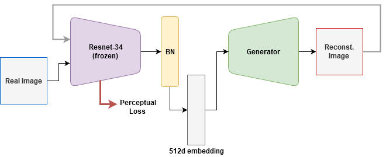
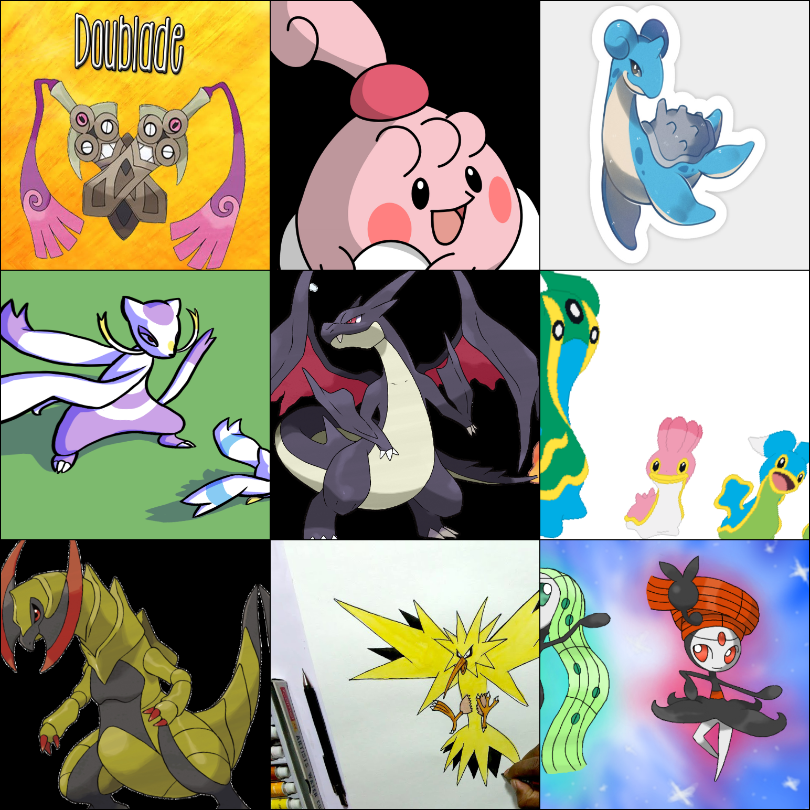
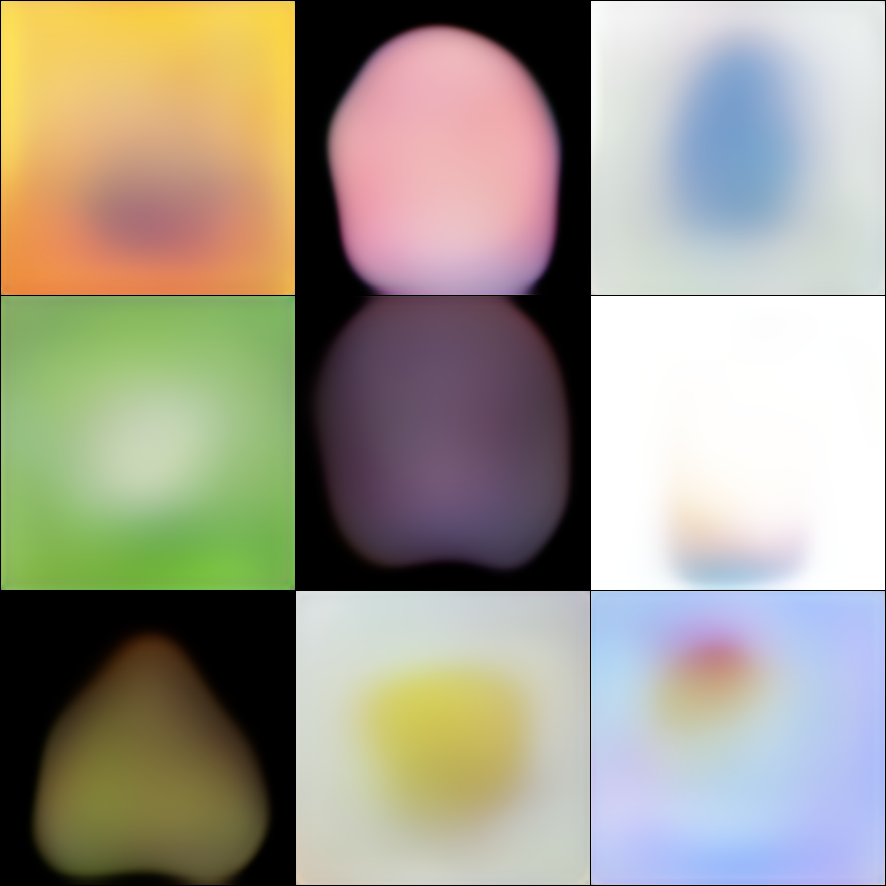
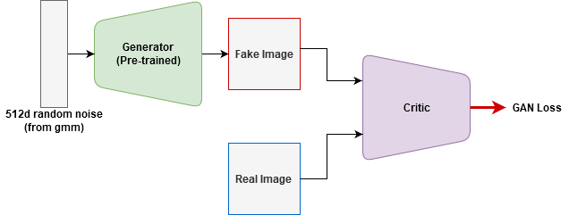

# PokeGAN-2.0
Using GANs to generate pokemons again[1](#pgftnote).

## Dataset
About 80,000 images of various Pokemon are downloaded from the Danbooru-2019 dataset[2](#dbftnote) and DuckDuckGo image search.

## Method
I tried to make the training easier with a modified approach to GAN training. The idea is to pre-train the generator to be moderately good at generating images, before starting the GAN training. Since GAN training is slow and unpredictable, using the adversarial training to fine-tune the pre-trained generator instead of completely training it from scratch should speed up convergence.

<!-- * <ins><b>Step-1</b></ins>:  -->
#### Step-1:

Train a Resnet-34 classifier to classify the 799 types of Pokemon images in the dataset. Note that if classification is not possible for a dataset, any other pre-text task (like [Rotnet]()) should also work. 

The output from the Resnet body is average pooled and flattened to convert the 3D tensors into 1D. This is followed by a BatchNorm layer and a fully connected head. The BatchNorm layer is special in that it has **no trainable affine parameters** and no record of running means and variances. This layer only normalizes the input with it's own mean and variance. This ensures that the latent embeddings are closer to a Gaussian distribution. 

<!-- * <ins><b>Step-2</b></ins>: -->
#### Step-2:

Freeze the trained Resnet-34 classifier and use it to encode images to 512d latent vectors. Train a generator to reconstruct the images from the encoded vectors. 

The generator is trained with perceptual losses. The same frozen Resnet model that generates image embeddings is used to calculate the perceptual loss. Reusing the same model greatly saves on memory requirements.
|                           |                           |
|:-------------------------:|:-------------------------:|
|  |  |
| **Input images** | **Reconstructed images** |

<!-- * <ins><b>Step-3</b></ins>: -->
#### Step-3:

Use the pre-trained generator for normal GAN training.

After the generator is pretrained with perceptual losses for a few epochs, normal GAN training is done. The random noise is not sampled from a standard normal distribution. Instead, a Gaussian Mixture Model is fit to the embeddings of all 80,000 images in the dataset. This model is used to sample random noise. WGAN-GP with Multi-Scale Gradients, WGAN-GP, WGAN and DCGAN were tried. There was not much of a difference in the results.

**Results after 5 epochs of training with WGAN-GP + MSG**

## Model

* The generator uses dilated convolutions in the later layers. Animated images have much less texture and more solid colours than normal images. Dilated convolutions artificially increase the receptive field of the convolutions without increasing the parameter count. The high receptive field might allow the model to  more easily generate large regions with solid colours.<!-- Using dilated convolutions might incentivize reducing texture in generated images. -->

* DCGAN loss was also tried other than the WGAN loss. While WGAN loss is known to be more stable than DCGAN, it also leads to slower convergence. When using the WGAN-GP variant of WGAN, there is also the added computational cost of calculating the gradient penalty. In normal DCGAN gradients only flow if neither the discriminator nor the generator is significantly more powerful than the other. The discriminator's job is initially much easier, since it is quite easy to separate the poor quality fake images from real images. If the discriminator becomes too good too quickly, the generator will not get trained anymore. Since the generator is pre-trained in this case, this problem does not exist and it is expected that the higher convergence speed of DCGAN can be utilised. But in reality, no significant difference was observed between all the GAN variants tried.

## Related Repositories

<a name="pgftnote">1</a>: [PokeGAN](https://github.com/Atom-101/PokeGAN)

<a name="dbftnote">2</a>: [Danbooru Dataset Maker](https://github.com/Atom-101/Danbooru-Dataset-Maker)
